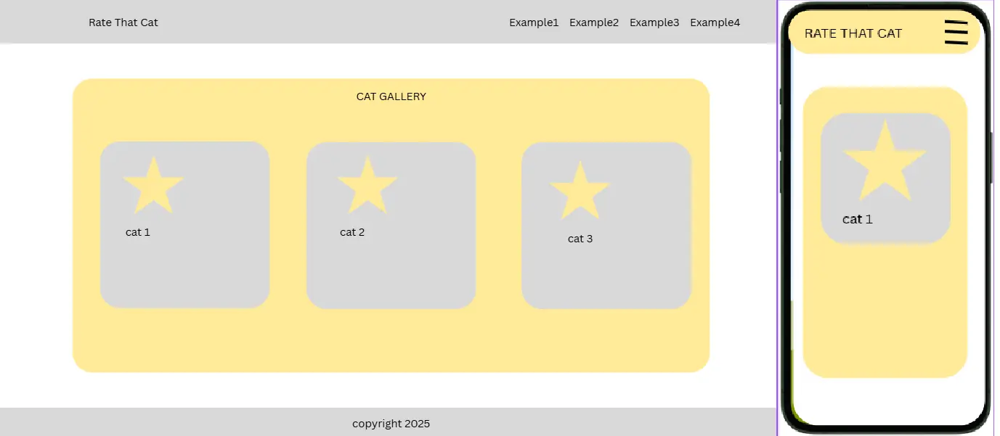
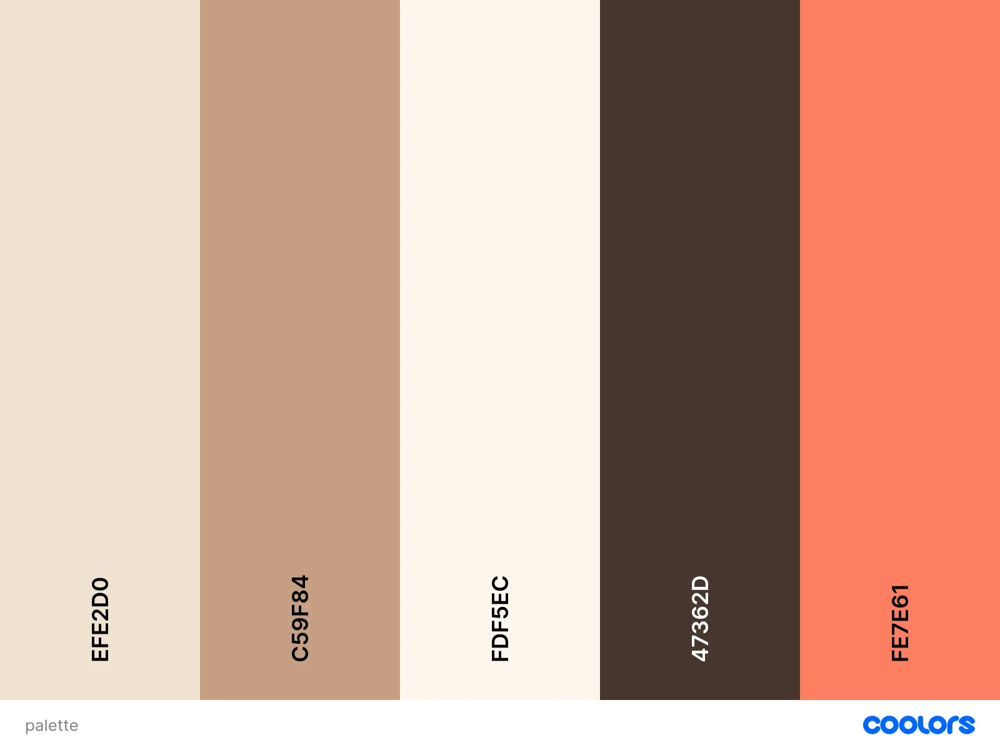
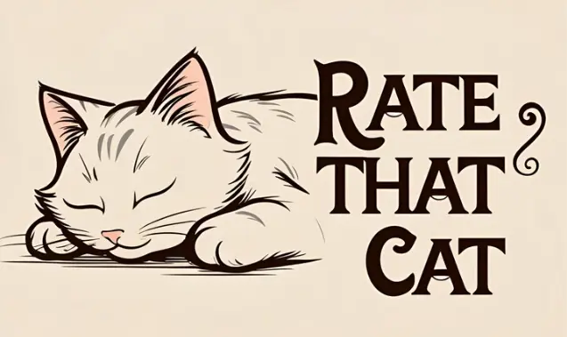
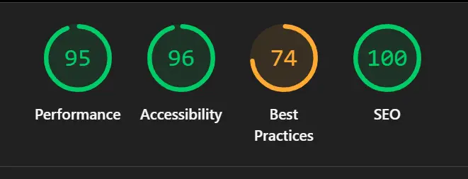
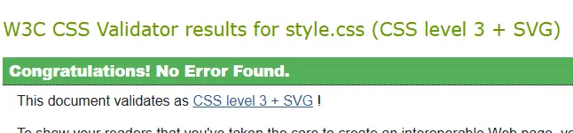
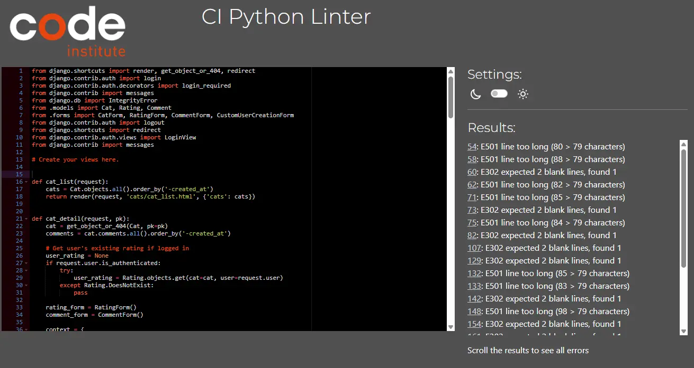

# Rate That Cat

## Overview

Rate That Cat is an interactive web application constructed using Django, with HTML, CSS, and the Bootstrap framework for the front-end. The purpose of the application is for users to share pictures of cats, either their own cats or simply pictures of cats they like, for other people to rate and comment on. The site features full CRUD functionality, allowing users to Create, Read, Update and Delete pictures, comments and ratings of cats.

Despite the forward-facing purpose of the website, it does not have the functionality to confirm that you are infact uploading a picture of a cat. In a isolated scenario outside of project time, I would implement procedure for admins to verify every picture uploaded to the site themselves. Until then, please be warned.

The live project can be found here: POSTLINKPOSTLINKPOSTLINK

## Table of Contents

- [Overview](#overview)
- [UX Design](#ux-design)
  - [User Stories](#user-stories)
  - [Wireframes](#wireframes)
  - [Colors](#colors)
  - [Fonts](#fonts)
  - [Logo Design](#logo-design)
- [Key Features](#key-features)
  - [User Authentication](#user-authentication)
  - [Cats, Ratings and Comments](#cats-ratings-and-comments)
- [Deployment](#deployment)
- [AI Implementation and Orchestration](#ai-implementation-and-orchestration)
- [Testing](#testing)
- [Future Enhancements](#future-enhancements)
- [Credits](#credits)

## UX Design

### User Stories

This project was created utilising an Agile workflow and MoSCoW prioritisation, with multiple user stories set up to explain the key features of the website and then fit into Github Projects. The User Stories were developed using a combination of personal ideas, feedback from friends and Claude AI.

The User Stories were as follows:

**User story #1:**
As a first-time user, I want to upload pictures of my cat so that others can see and rate them.
Acceptance Criteria:
The website allows logged-in users to upload pictures of their cat, which become visible to the online gallery.
These pictures can be rated and commented on by other users.
Tasks:
Create image upload model, create upload form view and template.
Restrict file type and size, add uploaded image to gallery view.

**User story #2:**
As a user, I want to add a name and description to each cat photo so that people know more about the cat.
Acceptance Criteria:
Users are able to add descriptions and titles to their cat pictures.
Tasks:
Update model to include name and description fields.
Display metadata on gallery and detail views.

**User story #3:**
As a visitor, I want to browse a gallery of uploaded cats so that I can enjoy them.
Acceptance Criteria:
Visitors to the website can browse all of the uploaded cat pictures in the gallery without logging in.
Tasks:
Create gallery view and template, style with thumbnails.
Allow functionality without login.

**User story #4:**
As a visitor/user, I want to view a detailed page for each cat so that I can see its full-size image and description.
Acceptance Criteria:
Clicking a cat opens its own page, with detailed title, description, rating, comments and full-size image.
Tasks:
Create detail view and template. Add comment and rating forms. Link from gallery to details.

**User story #5:**
As a user, I want to rate cats using a simple 1-10 rating system so that I can share my opinion..
Acceptance Criteria:
Users can rate cats from 1 to 10. Ratings are stored, and an average rating is shown under the cat.
Tasks:
Create rating model and form. Validate one rating per user per cat.
Calculate and update average rating. Display graphic for rating.

**User story #6:**
As a user, II want to comment on a cat photo so that I can share my thoughts or reactions.
Acceptance Criteria:
The website allows users who have rated a cat to comment on the cat so they can share their thoughts and explain their rating.
Tasks:
Create comment model and form. Have comment check for rating, and include rating next to comment.

**User story #7:**
As a new user, I want to sign up and log in so that I can upload and interact with content.
Acceptance Criteria:
The website allows its users to create accounts and sign in. They can then rate and comment on the cats.
Tasks:
Implement Django authorisation system. Restrict upload and comments to logged-in users.

**User story #8:**
As a user, I want to see my profile page with my uploaded cats and comments so that I can keep track of my activity.
Acceptance Criteria:
The website allows signed-in users to access their profile, where they can view their user info, uploaded cats and posted comments.
Tasks:
Create profile view and template. Query and display user uploads and comments.
Add link to profile in nav bar.

**User story #9:**
As a user, I want prevention from rating the same cat multiple times so that ratings stay fair.
Acceptance Criteria:
Users are only able to submit one rating per cat.
Tasks:
Check for existing rating before submission. Update existing rating or reject duplicate.

**User story #10:**
As a user, I want to make sure nobody uploads pictures of things that aren't cats, to keep the site safe and enjoyable.
Acceptance Criteria:
Users are only able to have their cat pictures uploaded to the gallery after a verified admin confirms it to be a cat picture.
Tasks:
Force manual verification from verified users for all cat pictures

**User story #11:**
As a user, I want the website to feature visually pleasing animations and carousel features.
Acceptance Criteria:
The website has fluid animations and carousels of popular cats.
Tasks:
Index cats by popularity, have particularly popular cats maintained on an animated bootstrap carousel.
Have various navigational aspects of the site support fade ins and fade outs.

**User story #12:**
As a user, I want to see which cat has had the most activity on the site over the last week, and have that cat celebrated.
Acceptance Criteria:
The website features a "Cat of the Week", displaying the cat that has received the most positive ratings.
Tasks:
Have site check for cat with most reviews at a 6/10 or above, and display that cat on the homepage.

### Wireframes

The wireframes for this project were created in Canva. They do not endeavour to show more than the general outline of the project, and were created very early in development as a loose structure to adhere to.

### Colors

The colours I chose for this project aimed to provide a warm, comforting atmosphere, focusing on soft chocolatey browns and creams to pose a feeling of relaxation.

More contrasting colours were chosen to better distinguish interactive elements such as buttons, without discarding the theme of warmth and coziness.

### Fonts

The fonts used in this project consisted of a combination of Chewy, Permanent Marker and Comic Relief.
The goal was to provide a feeling of playfulness and ease, while not straying too far from more mature themes, and reflecting the site's existence as a safe space for all. The chosen fonts are straightforward to read but still offer that hint of a mature joviality.

### Logo

The logo was generated using Canva's AI image generation software. I found ChatGPT and Microsoft Copilot to be incredibly stubborn when it came to prompts, often refusing to follow simple instructions in favour of preset biases. Canva's AI solution was much better at listening to me I found.

The image of a sleeping cat was chosen to emphasise safety and relaxation, playing into the site's concept of being purely for fun. 

## Key Features

### User Authentication

Full User Authentication functionality is present in the project, allowing creation of accounts, Logins and Logouts, and the security of posts and comments made by users being exclusively editable by the account they were created with. User accounts are intended as the primary target for moderation on the site, and as a result, Visitors to the site who do not have accounts cannot upload cats, nor leave comments or ratings.

### Cats, Ratings and Comments

The purpose of the website is for users to share pictures of cats, so that other users can comment on and rate them. The site accomodates this, and allows any logged in user the ability to post cats, ratings and comments, and gives them full control over that content once it has been posted.

CRUD functionality was a focus of the project, and as a result every post the user makes, cat, rating or comment, can be edited or deleted, each carrying a success or failure message to properly portray the information to the user.

## Deployment

The project is being deployed to Heroku. The simple steps for deploying this project to Heroku are as follows:
1. Create a Heroku App.
2. Clone the repository locally.
3. Set up the Heroku environment with a PostgreSQL database and Cloudinary integration.
4. Set up your environment variables both in your local development environment and in the Heroku Config Vars.
5. Link your Heroku app to the cloned repo once it has been pushed, and deploy.

The project was frequently deployed live to Heroku, so as to avoid falling into the trap of deployment-exclusive errors.

## AI Implementation and Orchestration

AI has been invaluable in the creation of this project and the ability to meet deadlines. 
Claude, Copilot and ChatGPT were all used to facilitate faster code blocks and debugging. Claude has been particularly useful, on account of its ability to read your entire repo for context. ChatGPT has been used mainly for concepts and ideas. Copilot context can be frustrating to work with compared to Claude, but returns equally impressive answers if the correct contexts are given.

There were multiple times where I was able to provide my entire codebase to Claude, and as a result it was able to diagnose a problem that Copilot or ChatGPT couldn't find. This accelerated development significantly.

AI has proved itself as an incredibly useful tool in the development process, but one that is dangerous to rely on. AI code has a habit of being messy, and bogged down with multiple lines of unnecessary code. It can misinterpret you easily, and if you accept given responses without thinking, you risk damaging the integrity of your code.

## Testing

Lighthouse testing was done on desktop, with mobile responsiveness tested through DevTools. 
The scores suffers a lot due to Cloudinary, which carries some of its own cookies for data collection and analytics.

I also used Nu HTML Checker initially to test my code, but due to my use of Django supported template shortcuts, the HTML Checker returned many false negatives. HTML showed full functionality despite failures and ran flawlessly between different platforms and deployment environments.

Jigsaw was used for CSS validation, which showed no errors.

Code Institute's CI PYthon Linter was also demonstrated on my views.py, returning only mild issues with spacing and line length.

Individually, every feature of the websites core and extended functionality were tested in a local and deployment environment, with no issues.

## Changes I would make

With more time, I would create a form of admin validation, that prevented images from being uploaded to the website without approval from an admin or moderator. I would also have liked to develop the styles further, and to have cleaned up the code structure. 

## Credits

- Claude and Copilot, for major assistance in creation of code blocks and debugging.
- Emilyhugs on github, for providing a comfortable structure and standard for the project.
- Dillon, for sticking with us